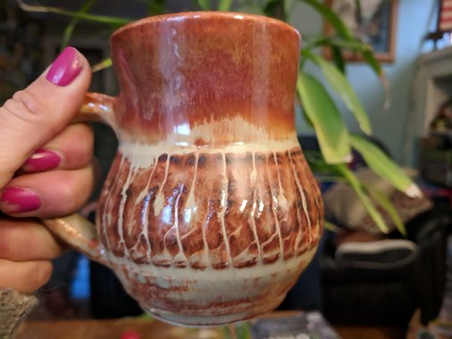
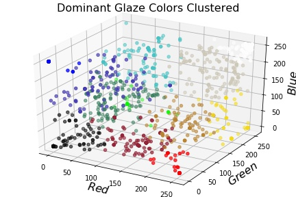

# Ceramic Glaze Design

## The Project
From data including ceramic glaze chemical makeup, RGB color, opacity, and firing temperature, train various models to predict properties given chemical makeup. This information would be extremely useful to potters interested in glaze design. 

[Here](https://github.com/ilanazim/Ceramic_Glaze_Design/blob/master/glaze_exp.ipynb) is where all my work has taken place so far. 

## Work in Progress

Currently working on a multiclass regressor to predict color given glaze chemistry.
My ultimate goal is to create an interactive tool where folks can input a glaze chemical makeup (in percent volume per chemical component - summing to 1), and the predicted color, transparency, surface texture, and firing temperature will be displayed with associated confidence. 

|||
|--|--|
|

|

|

____________________________________________
Dependencies:
* `pandas`
* `re`
* `sklearn`
* `eli5`
* `matplotlib`
* `colorsys`
* `PIL.Image`

